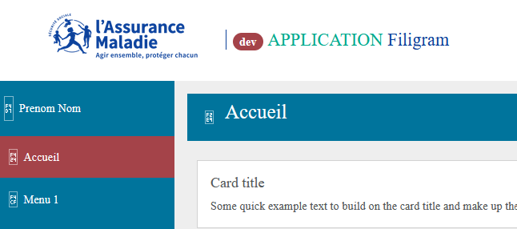

======
Assets
======

FrontBundle utilise `Webpack <https://webpack.js.org>`_ (via Symfony's `Webpack Encore <https://symfony.com/doc/current/frontend.html>`_) pour gérer ses ressources CSS et JavaScript.
Ce bundle fournit à la fois les fichiers source et les fichier compilés vous n'avez donc pas besoin d'installer Webpack pour utiliser ce bundle.

Cependant vous pouvez avoir un control total sur les assets et les styles en utilisant Webpack pour build les fichiers CSS, SCSS et JavaScript fourni dans le dossier ``assets/`` du bundle.

Ajouter des composants JS et CSS
================================

Pour ajouter des librairies JS, des extensions DataTables ou autre il faut ajouter du JS et du CSS dans le template twig.
Pour ça, il faut utiliser les blocs Twig défini dans le template du bundle.

**Par exemple :** pour ajouter l'extension colReorder au DataTables

*templates/base.html.twig*

.. code-block:: twig

    
        {# On inclut les styles du layout de base du bundle #}
        {{ parent() }}
        {# Ajout des CSS de l'extension colReorder #}
        <link rel="stylesheet" href="https://cdn.datatables.net/colreorder/1.5.6/css/colReorder.dataTables.min.css">
    

    
        {# On inclut les script JS du layout de base du bundle #}
        {{ parent() }}
        {# Ajout des JS de l'extension colReorder #}
        

        {# On reconstruit le DataTable #}
        
    

Utiliser WebPack pour surcharger les assets
===========================================

Si vous utilisez Webpack dans votre projet vous pouvez utiliser, réécrire voir surcharger les assets du bundle
pour build votre propre version.

**Par exemple :** pour builder des nouveaux assets contenants ceux du FrontBundle et l'extension colReorder de DataTables

*assets/app.js*

.. code-block:: js

    // any CSS you import will output into a single css file (app.css in this case)
    import './styles/app.css';

    // Import du app.js du FrontBundle
    import '../vendor/sbyaute/front-bundle/assets/app.js'
    import 'datatables.net-colreorder'

    class App {
      constructor() {
        window.addEventListener("FrontBundleLoaded", (event) => {
          $.extend(true, $.fn.dataTable.defaults, {
            buttons: [
              'print', 'csv'
            ],
            dom: 'Bfti',
            colReorder: true
          });
          $('#demo-dataTable').DataTable();
        });
      }
    }

    new App();

On remplace les assets du FrontBundle par ceux du projet.

*templates/base.html.twig*

.. code-block:: twig

    

    
        {{ encore_entry_link_tags('app') }}
    

    
        {{ encore_entry_script_tags('app') }}
    

.. note::
    Pour build les assets FrontBundle vous aurez besoin d'activer **Sass / SCSS**.
    Pour cela vous devez activer cette fonctionnalité dans la configuration **Encore**
    et installer la dépendance adéquate.

*webpack.config.js*

.. code-block:: js

    Encore
        ...
        // enables Sass/SCSS support
        //.enableSassLoader()
        ...
    ;

.. code-block:: bash

    npm install sass-loader@^13.0.0 sass --save-dev

Un peu de documentation concernant l'installation de `Encore <https://symfony.com/doc/5.4/frontend/encore/installation.html>`_
et la configuration `Encore / WebPack <https://symfony.com/doc/5.4/frontend/encore/simple-example.html>`_ ...

Utiliser Webpack et FrontBundle
===============================

Vous pouvez utiliser Webpack dans votre projet pour gérer vos CSS et JS sans vouloir build les assets du bundle avec ceux de votre projet.

Dans ce cas vous aurez juste à utiliser les blocs Twig du layout bundle pour inclure vos JS et CSS compilés.

**Par exemple:** pour ajouter DataTable colReorder

*assets/datatables-colreorder.js*

.. code-block:: js
    // Asset qui permet d'ajouter l'extension colReorder

    // any CSS you import will output into a single css file
    import './styles/mon-style.css';

    import 'datatables.net-colreorder'

    window.addEventListener("FrontBundleLoaded", (event) => {
      $.extend(true, $.fn.dataTable.defaults, {
        buttons: [
          'print', 'csv'
        ],
        dom: 'Bfti',
        colReorder: true
      });
      $('#demo-dataTable').DataTable();
    });

Ajout du css et JS build par Webpack à ceux provenant du layout du bundle

*templates/base.html.twig*

.. code-block:: twig

    
        {# Ajout du css build par Webpack à ceux provenant du layout du bundle #}
        {{ parent() }}
        <link rel="stylesheet" href="{{ asset('build/datatables.css') }}">
    

    
        {# Ajout du js build par Webpack à ceux provenant du layout du bundle #}
        {{ parent() }}
        
    

Modifier le chemin vers les assets
==================================

Les assets générés par FrontBundle sont uniquement prévus pour fonctionner lorsque l'application se trouve à la racine de l'URL.

Exemple de point d'entrée fonctionnel : ``https://[HOSTNAME]:[PORT]``.

Exemple de point d'entrée non fonctionnel : ``https://[HOSTNAME]:[PORT]/monapplication/public``.

Les chemins vers les assets sont de la forme ``/bundles/front/...``.
Dans le cas où l'application n'est pas accessible à la racine de l'URL,
les chemins devraient être de la forme ``/monapplication/public/bundles/front/...``.

Ce problème est facilement identifiable par l'absence d'icône et l'utilisation de la police par défaut du navigateur :

Pour permettre un bon fonctionnement des assets avec ce type d'URL,
appliquez une réécriture des URL à l'aide d'un fichier ``.htaccess``.

Le fichier doit être positionné dans le répertoire correspondant à la racine de l'URL.

**[DOCUMENT_ROOT]/.htaccess**

.. code-block::

    <IfModule mod_rewrite.c>
        RewriteEngine On

        RewriteRule "bundles/front/(.*)" "monapplication/public/bundles/front/$1"
    </IfModule>

.. warning::
    Ce type de configuration ne convient pas à un environnement de production.
    En production, privilégiez une URL simple ``https://[HOSTNAME]:[PORT]``.
