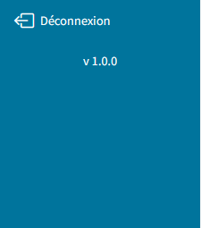

===========
Déconnexion
===========

Le paramètre de configuration ``front.logout`` vous permet d'indiquer au bundle,
s'il doit afficher ou non un lien de déconnexion.

.. code-block:: yaml

    front:
        # Détermine si le lien de déconnexion est affiché ou non (false par défaut)
        logout: false

Si la valeur de ``front.logout`` est ``true``, un lien de déconnexion est automatiquement ajouté au menu.

L'affichage du lien de déconnexion nécessite de configurer une route de ``logout``.

Configurer le logout
--------------------

Voici un exemple de configuration :

.. code-block:: yaml

    # config/packages/security.yaml
    security:
        ...
        firewalls:
            secured_area:
                pattern:    ^/.*
                anonymous: ~
                guard:
                    authenticators:
                        - Sbyaute\AuthSrvSecBundle\Authenticator\BouchonAuthenticator
                        - Sbyaute\AuthSrvSecBundle\Authenticator\SrvSecAuthenticator
                    entry_point: Sbyaute\AuthSrvSecBundle\Authenticator\SrvSecAuthenticator
                logout:
                    # Route de déconnexion
                    path: app_logout
                    # Route de redirection après déconnexion
                    target: home
        access_control:
            - { path: ^/$, roles: IS_AUTHENTICATED_ANONYMOUSLY }
            - { path: ^/.+, roles: IS_AUTHENTICATED_FULLY }

.. warning::
    Le lien de déconnexion sera affiché pour les routes acceptant un accès anonyme,
    uniquement si ces routes sont intégrées au firewall.

    Dans l'exemple ci-dessus, la page d'accueil */* ne nécessite pas d'authentification.
    Pour autant, le lien de déconnexion doit être affiché si l'utilisateur est authentifié.

.. code-block:: php

    # src/Controller/SecurityController
    <?php

    namespace App\Controller;

    use Symfony\Bundle\FrameworkBundle\Controller\AbstractController;
    use Symfony\Component\Routing\Annotation\Route;

    class SecurityController extends AbstractController
    {
        /**
        * @Route("/logout", name="app_logout", methods={"GET"})
        */
        public function logout(): void
        {
            // controller can be blank: it will never be called!
            throw new \Exception('Don\'t forget to activate logout in security.yaml');
        }
    }

Pour plus d'informations, consultez la documentation Symfony `Logging Out <https://symfony.com/doc/5.4/security.html#logging-out>`_.
