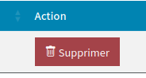
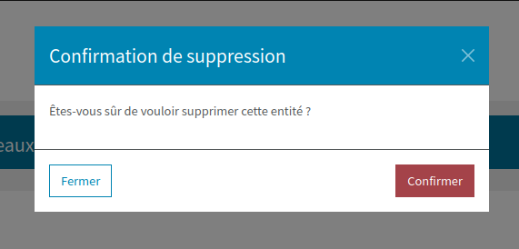

==============================
Modale de suppression d'entité
==============================

Ce bundle propose également **un système pour mettre en place une suppression d'entité en 2 temps** (avec popin de
confirmation).
Voici la description du fonctionnement :

#. Dans un template Twig, affichage d'un bouton de suppression (avec le nom logique pour cette suppression et l'ID de l'entité à supprimer ) et inclusion de la modale.
#. Au clic sur le bouton, le système affiche la modale en ayant peuplé un champ caché avec l'ID de l'entité à supprimer.
#. A la confirmation de la modale, le système créé une requête ``POST`` vers la route fournie pour prise en compte de la suppression.

Voici le détail de ce processus ci-dessous.

Affichage du bouton
===================
Une extension Twig est à disposition pour générer un bouton : ``{{ generate_delete_button('user', 32) }}``. Dans cet exemple,
un bouton sera généré pour supprimer une entité d'ID 32, dans "l'espace de nom" ``user``.

Voici le rendu du bouton :

.. note::
    L'ID est typehinté ``string`` sur toute la chaîne pour permettre l'utilisation d'`UUID <https://github.com/ramsey/uuid-doctrine>`_.

Afficher le bouton dans une Datatable avec chargement des données en Ajax
-------------------------------------------------------------------------

Comme les données sont chargées en Ajax, il n'est pas possible d'utiliser l'extension twig pour générer le bouton pour chaque élément.
A la place, il faut **générer un bouton template avec un faux id** (par exemple : ``__id__``).
Ce template sera copié lors du chargement des données dans la bonne colonne en remplaçant le faux id par celui de l'élément à supprimer.

**Exemple :**

Création du template

.. code-block:: twig

    {{ generate_delete_modal('user', 'delete_user') }}
    
{{ generate_delete_button('user', '__id__') }}

Utilisation d'une fonction pour affecter la propriété data de la Datatable lors du chargement en Ajax

.. code-block:: javascript

    "columns": [
        {
            "data": "email",
            "name": "email"
        },
        {
            "data": function (row, type, val, meta) {
                return $('#user_delete_button_template').html().replace('__id__', row.id);
            },
            "name": "actions"
        }
    ]

Inclusion de la modale
======================
A ce stade, un clic sur le bouton ci-dessus ne provoque rien puisque la modale est inexistante. Elle peut être incluse
simplement par ``{{ generate_delete_modal('user', 'route_to_delete') }}``, avec :

#. ``user`` l'espace de nom pour appairer la modale avec le (ou les) bouton(s) ajoutés au-dessus.
#. ``route_to_delete`` étant la route de suppression de l'entité.

Voici le rendu de la modale :

.. note::
    L'extension Twig incluant la modale ne doit être appelée qu'une seule fois par espace de nom et par template, **puisque qu'elle est
    la même pour toutes les demandes de suppression**.

Exemple d'implémentation :

.. code-block:: twig

    
        {{ generate_delete_button('user', user.id) }}
    

    
        {{ generate_delete_button('appointment', appointment.id) }}
    

    {{ generate_delete_modal('user', 'delete_user_route') }}
    {{ generate_delete_modal('appointment', 'delete_appointment_route') }}

.. note::
    L'exemple ci-dessus illustre la possibilité d'ajout de N modales de suppression **appairées par nom avec les boutons
    associés**.

Surcharge éventuelle de la modale
---------------------------------

Afin de maximiser la personnalisation, il est possible de surcharger le template de la modale **par nom**. Si
aucune surcharge n'est trouvée, le template par défaut est utilisé. Voici un exemple de surcharge :

#. Dans ``templates/bundles`` (la racine au sein de votre projet à utiliser afin de pouvoir `surcharger n'importe quel template de n'importe quel bundle utilisé <https://symfony.com/doc/current/bundles/override.html#templates>`_), créez un dossier ``FrontBundle/delete-modal`` (qui contiendra les surcharges éventuelles des modales)
#. Pour surcharger la modale pour l'espace de noms ``user``, crééz le fichier Twig suivant : ``delete_modal_user.html.twig``
#. Récupérez le code de la modale par défaut qui se trouve dans ``vendor/sbyaute/front-bundle/Resources/views/delete-modal/default_delete_modal.html.twig`` et apportez-y les modifications que vous souhaitez.

.. note::
    La convention de nommage pour un template de surcharge est donc : ``delete_modal_<name>.html.twig``.

Récupération de l'entité à supprimer
====================================

Le ``DeleteForm`` utilisé n'est volontairement pas mappé sur une classe. Vous pouvez récupérer l'ID de l'entité à supprimer
en exploitant l'objet ``Request`` dont vous prendrez soin d'injecter la dépendance.

.. code-block:: php

    /**
     * @Route("/delete-user", name="delete_user", methods={"POST"})
     */
    public function delete(
        Request $request,
        UserRepository $userRepository
    )
    {
        $user = $userRepository->find(
            $request->get('delete_form_user')['id']
        );

        $this->entityManager->remove($user);
        $this->entityManager->flush();

        return $this->redirectToRoute('users_list');
    }

.. note::
    Pour pouvoir avoir plusieurs formulaires sur la même page, **le nom du formulaire est suffixé de l'espace de nom
    passé lors de la création de la modale**. La convention de nommage du formulaire est donc : ``delete_form_<name>``.
