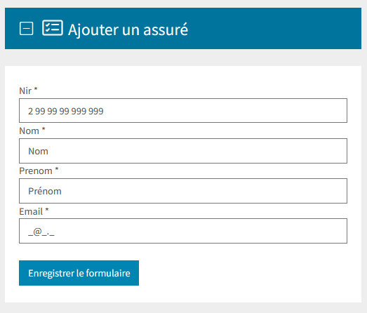
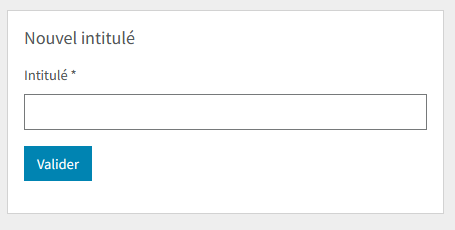

===========
Formulaires
===========

*FrontBundle* utilise le `thème Bootstrap 5 <https://symfony.com/doc/current/form/bootstrap5.html>`_ de *Symfony*
permettant d'ajouter automatiquement les classes adéquates aux éléments composant le formulaire.

C'est ce qui permet, par exemple, d'ajouter la classe ``form-label`` aux éléments ``label`` des formulaires.

Ainsi, vous n'avez en principe, pas besoin d'intervenir dans le rendu d'un formulaire qui a été généré en utilisant
les méthodes `Symfony`.

.. note::
    Attention : il existe des cas particuliers, notamment concernant le rendu des checkboxes, radios, input groups, floating labels, etc.
    Nous vous invitons à consulter `la documentation Symfony à ce sujet <https://symfony.com/doc/current/form/bootstrap5.html#checkboxes-and-radios>`_.

Exemple de formulaire
---------------------

.. code-block:: php

    <?php

    namespace App\Form;

    use Sbyaute\FormTypeBundle\Type\NirType;
    use Symfony\Component\Form\AbstractType;
    use Symfony\Component\Form\Extension\Core\Type\SubmitType;
    use Symfony\Component\Form\Extension\Core\Type\TextType;
    use Symfony\Component\Form\FormBuilderInterface;

    class AssureType extends AbstractType
    {
        public function buildForm(FormBuilderInterface $builder, array $options)
        {
            $builder
                ->add('nir', NirType::class, [
                    'data_mask' => true,
                ])
                ->add('nom', TextType::class)
                ->add('prenom', TextType::class)
                ->add('email', TextType::class, [
                    'attr' => [
                        'data-inputmask' => "'alias': 'email'",
                    ],
                ])
                ->add('save', SubmitType::class, [
                    'label' => 'Enregistrer le formulaire'
                ])
            ;
        }
    }

Dans cet exemple, on notera l'utilisation des fonctionnalités particulières suivantes, intégrées par le *SK* :

- l'utilisation du champ Nir ``Sbyaute\FormTypeBundle\Type\NirType`` (FormTypeBundle)
- l'application d'un masque de saisie ``InputMask`` (FrontBundle)

L'intégration de `Bootstrap 5` vous permet d'obtenir le rendu suivant sans qu'aucun ajustement ne soit nécessaire :

Champs requis
-------------

Un astérisque est automatiquement associé au label d'un champ obligatoire (attribut ``required``).

L'attribut ``required`` est destiné au navigateur et sera interprété avant l'envoi du formulaire.

**Il est possible d'afficher cet astérisque même si le champ n'est pas indiqué comme étant requis.**

Ce cas de figure peut se présenter lorsque l'on ne souhaite pas activer la vérification par le navigateur
tout en associant une contrainte au champ en question.

.. code-block:: php

    $formuBuilder->add('intitule', TextType::class, [
        'label' => 'Intitulé',
        'required' => false,
        'constraints' => [new NotBlank([], 'Veuillez compléter ce champ')],
        // La classe required est ajoutée explicitement
        'label_attr' => ['class' => 'required']
    ])

Validation par le navigateur
----------------------------

Concernant la validation du formulaire par le navigateur, nous vous invitons à vous référer à
`la documentation Bootstrap 5 <https://getbootstrap.com/docs/5.2/forms/validation/>`_.

