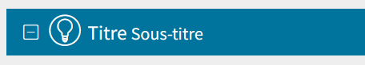
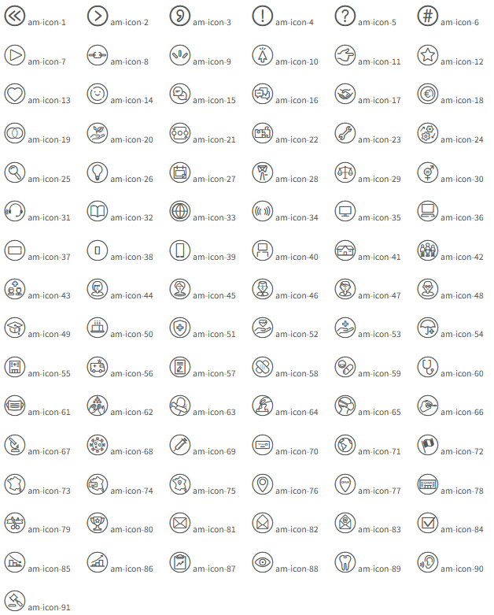
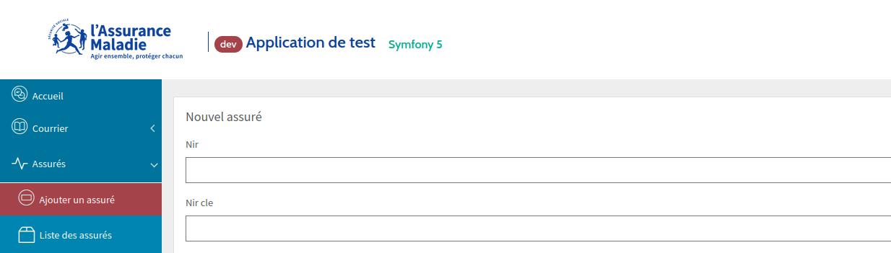
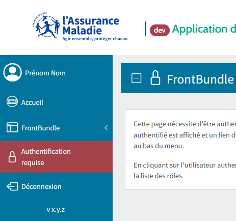
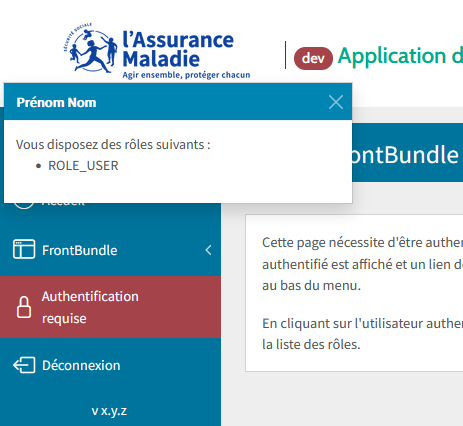

=====================
Utilisation du layout
=====================

.. _activer-le-layout:

Activer le layout
=================

Remplacez le contenu de votre fichier ``base.html.twig`` par :

.. code-block:: twig

    

.. _parametrer-les-templates:

Paramétrer les templates
========================

Les différents templates doivent contenir au minimum les lignes suivantes :

.. code-block:: twig

    
    
    
        <article class="row mb-4 p-2 bg-white">
            Lorem ipsum dolor sit amet.
        </article>
    

Vous pouvez également spécifier un sous-titre et un pictogramme :

.. code-block:: twig

    
    

Référez-vous à la `liste complète des pictogrammes disponibles <#_pictogrammes>`_.

.. _pictogrammes:

Pictogrammes disponibles
========================

.. note::

    Les pictogrammes *Fontawesome* présents dans *TwigBootstrapBundle* ont été remplacées par les icônes *Bootstrap*.

Icônes Bootstrap
----------------

Documentation `Bootstrap Icons <https://icons.getbootstrap.com/>`_.

.. code-block:: html

    <i class="bi-activity"></i>
    <!-- Application d'une classe Bootstrap -->
    <i class="bi-activity text-success"></i>
    <!-- Application d'une classe FrontBundle -->
    <i class="bi-activity am-coul-mauve-600"></i>

Icônes Assurance Maladie
------------------------

.. code-block:: html

    <i class="am-icon-26"></i>
    <!-- Application d'une classe Bootstrap -->
    <i class="am-icon-26 text-success"></i>
    <!-- Application d'une classe FrontBundle -->
    <i class="am-icon-26 am-coul-mauve-600"></i>

- icônes cerclées : am-icon-[1-91]
- icônes non cerclées : am-icon-sc-[1-91]

.. warning::

    Le pictogramme doit toujours être utilisé dans son cercle. Le style pictographique est inspiré de la ronde de la vie.
    Une exception est faite pour le menu afin d'en améliorer la lisibilité.

Typographie
===========

La police *Source Sans Pro normal* est activée par défaut.

Les polices disponibles peuvent être explicitement sélectionnées en utilisant les classes *CSS* et variables *LESS* suivantes :

- Source Sans Pro normal ``.font-source-sans-pro``
- Arial ``.font-arial``
- Cabin normal ``.font-cabin``

Palette **Digital**
===================

La déclinaison complète de la palette *Digital* est disponible sous la forme de classes *CSS* et de variables *SCSS*.

- propriété *color* ``.am-coul-[couleur]-[n]``
- propriété *background-color* ``.am-bg-coul-[couleur]-[n]``
- propriété *border-color* ``.am-br-coul-[couleur]-[n]``

Où ``[coul]`` est compris dans la liste :

- bleu-am
- cyan
- bleu-givre
- parme
- rose
- mauve
- brique
- orange
- jaune
- vert
- turquoise
- gris
- turquoise
- gris

Et ``[n]`` est une valeur facultative parmi 100, 200, 300, 400, 500, 600, 700, 800, et 900.

Ces couleurs sont attribuées à des classes dont l'usage est explicite :

- propriété *color* ``.am-coul-[usage]-[n]``
- propriété *background-color* ``.am-bg-coul-[usage]-[n]``
- propriété *border-color* ``.am-br-coul-[usage]-[n]``

Où ``[usage]`` est compris dans la liste :

- titre-page
- fond
- menu-top
- menu-top-fond
- menu
- menu-header
- menu-actif
- menu-fond
- entete-fond
- contenu-fond
- marque
- texte
- texte-inverse

Pour plus de détails sur l'attribution des couleurs, vous pouvez consulter les fichiers :

- ``assets\styles\palette.scss``
- ``assets\styles\main.scss``

Personnaliser les templates
===========================

Le FrontBundle offre la possibilité de personnaliser le template de base pour l'adapter à vos besoins.

Blocs Twig disponibles
----------------------

Il est possible d'utiliser les blocs Twig ci-dessous pour modifier le comportement du template.

- ``head`` : entêtes *meta*
- ``favicon`` : balise *link* contenant la favicon
- ``title`` : contenu de la balise *title*
- ``stylesheets`` : balises *link[rel=stylesheet]*
- ``javascripts`` : balises *script*
- ``javascripts_end`` : balises *script* permet d'executer du script javascript en fin de body
- ``body_class`` : permet d'associer une ou plusieurs classes à la balise *body*
- ``body`` : contenu de la balise *body*
- ``menu_aside`` : le menu de gauche
- ``body_header`` : titre de la page intégrant le pictogramme et le sous-titre
- ``content`` : contenu de la page
- ``toast_user`` : modal d'affichage des roles de l'utilisateur

**Exemple :** suppression du block de titre de la page

.. code-block:: twig

    
    

Utiliser les embed
------------------

Le layout ``@Front/layout.html.twig``, est composé de blocs et de sous templates importés avec la balise ``embed``.
Vous pouvez redéfinir ou surcharger le comportement de ces parties de pages en utilisant la balise ``embed`` et les blocs des sous-template.

**Exemple :** suppression de l'affichage de l'utilisateur connecté dans le menu

.. code-block:: twig

    
        
            
        
    

.. warning::

    Il est impossible d'utiliser les blocs définis dans les templates embed directement dans votre templates.
    Vous devez les utiliser dans la balise ``embed`` comme dans l'exemple ci-dessus.

User
----

Le `FrontBundle <https://gitlab.cnqd.sbyautets.fr/STARTER_KIT_PHP-2015/Bundles/FrontBundle>`_ se charge de l'affichage de l'utilisateur connecté.

Le nom et prénom de l'utilisateur authentifié est affiché en haut du menu.

En cliquant sur l'utilisateur authentifié, vous avez accès à la liste des rôles.

Le `FrontBundle <https://gitlab.cnqd.sbyautets.fr/STARTER_KIT_PHP-2015/Bundles/FrontBundle>`_ utilise un ``UserModel`` générique pour afficher les informations de l'utilisateur connecté dans l'interface.
Ce ``UserModel`` est hydraté grâce à un ``UserSubscriber`` qui écoute l'évènement ``Sbyaute\FrontBundle\Event\UserEvent``.

A vous d'écrire ce Subscriber pour intégrer les données de votre utilisateur au ``UserModel``.

.. warning::

    Vous devez avoir un système d’authentification fonctionnel (Exemple : `AuthSrvSecBundle <https://gitlab.cnqd.sbyautets.fr/STARTER_KIT_PHP-2015/Bundles/AuthSrvSecBundle>`_,
    `WebSSOBundle  <https://gitlab.cnqd.sbyautets.fr/STARTER_KIT_PHP-2015/Bundles/WebSSOBundle>`_ ou `Security de Symfony <https://symfony.com/doc/5.4/security.html>`_).

Par exemple : ``src/EventSubscriber/UserSubscriber.php``.

.. code-block:: php

    <?php

    namespace App\EventSubscriber;

    use Sbyaute\FrontBundle\Event\UserEvent;
    use Sbyaute\FrontBundle\Model\UserModel;
    use Symfony\Component\EventDispatcher\EventSubscriberInterface;
    use Symfony\Component\Security\Core\Security;

    class UserSubscriber implements EventSubscriberInterface
    {
        /**
         * @var Security
         */
        protected $security;

        /**
         * @param Security $security
         */
        public function __construct(Security $security)
        {
            $this->security = $security;
        }

        /**
         * @param UserEvent $event
         * @return void
         */
        public function onShowUser(UserEvent $event)
        {
            $myUser = $this->security->getUser();

            if (null === $myUser) {
                return;
            }

            $user = new UserModel();
            $user
                ->setPrenom($myUser->getGivenName())
                ->setNom($myUser->getFamilyName())
                ->setRoles($myUser->getRoles())
            ;

            $event->setUser($user);
        }

        /**
         * @return string[][]
         */
        public static function getSubscribedEvents(): array
        {
            return [
                UserEvent::class => ['onShowUser'],
            ];
        }
    }
