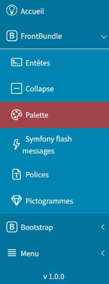
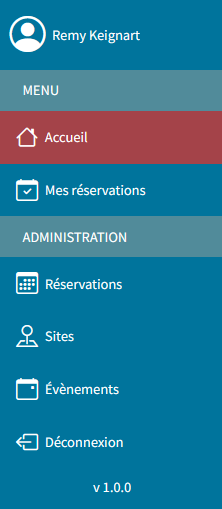
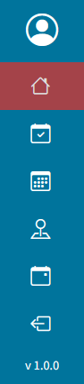
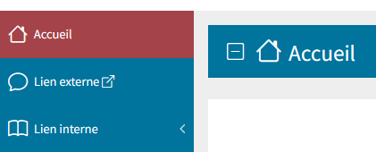
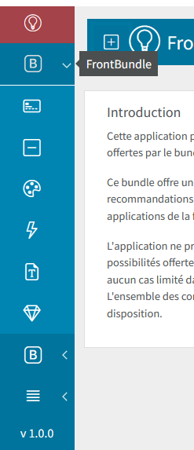

====
Menu
====

La gestion du menu s'appuie :

- sur le bundle *Symfony* `knplabs/knp-menu-bundle <https://github.com/KnpLabs/KnpMenuBundle>`_.
- sur la librairie *Javascript* `metismenujs <https://github.com/onokumus/metismenujs>`_.

Créer votre menu
----------------

.. note::
    Si vous avez utilisé **Symfony Flex** pour l'installation du bundle, un fichier
    ``src/EventSubscriber/KnpMenuBuilderSubscriber.php`` basique a été automatiquement créé.

Créez le fichier ``src/EventSubscriber/KnpMenuBuilderSubscriber.php``, vous pourrez y
construire votre menu.

Exemple de construction :

.. code-block:: php

    <?php

    namespace App\EventSubscriber;

    use Sbyaute\FrontBundle\Event\KnpMenuEvent;
    use Symfony\Component\EventDispatcher\EventSubscriberInterface;
    use Symfony\Component\Security\Core\Security;

    class KnpMenuBuilderSubscriber implements EventSubscriberInterface
    {
        private $security;

        public function __construct(Security $security)
        {
            $this->security = $security;
        }

        public static function getSubscribedEvents(): array
        {
            return [
                KnpMenuEvent::class => ['onSetupMenu', 100],
            ];
        }

        public function onSetupMenu(KnpMenuEvent $event)
        {
            $menu = $event->getMenu();

            $menu->addChild('Menu', [
                'route' => '',
                'label' => 'MENU',
            ])->setAttribute('class', 'header');

            $menu->addChild('Accueil', [
                'route' => '',
                'label' => 'Accueil',
            ])->setLabelAttribute('icon', 'am-icon-15');

            $menu->addChild('Groupe', [
                'label' => 'Groupe',
            ])->setLabelAttribute('icon', 'am-icon-32');

            $menu->getChild('Groupe')->addChild('Element', [
                'route' => '',
                'label' => 'Élément',
            ])->setLabelAttribute('icon', 'bi-gem');

            $menu->getChild('Groupe')->addChild('2-Element', [
                'route' => '',
                'label' => '2nd élément',
            ])->setLabelAttribute('icon', 'bi-activity');

            $menu->getChild('Groupe')->addChild('Sous-groupe', [
                'label' => 'Sous-groupe',
            ])->setLabelAttribute('icon', 'bi-alarm');

            $menu->getChild('Groupe')->getChild('Sous-groupe')->addChild('Sous-Elément', [
                'route' => '',
                'label' => 'Sous-élément',
            ])->setLabelAttribute('icon', 'bi-balloon');

            if ($this->security->isGranted('ROLE_ADMIN')) {
                $menu->getChild('Groupe')->getChild('Sous-groupe')->addChild('2-Sous-Elément', [
                    'route' => '',
                    'label' => '2nd sous-élément',
                ])->setLabelAttribute('icon', 'am-icon-45');
            }
        }
    }

Groupes de liens
----------------

Vous pouvez créer une hiérarchie, ce qui vous permet d'afficher des sous-menus. Voir des sous-menus de sous-menus.
L'exemple ci-dessus illustre bien cette possibilité.

Notez qu'il n'est pas obligatoire d'associer une route à un élément du menu. Cela peut-être utile pour l'élément
chapeau d'un groupe de lien justement.

Entêtes de menu
---------------

Vous pouvez ajouter des entêtes afin de séparer les différents éléments qui composent votre menu.

.. code-block:: php

    <?php
    # KnpMenuBuilderSubscriber
    ...
    public function onSetupMenu(KnpMenuEvent $event)
    {
        $menu = $event->getMenu();

        $menu->addChild('Menu', [
            'route' => '',
            'label' => 'MENU',
        ])->setAttribute('class', 'header');
        ...
    }
    ...

.. warning::

    Les entêtes ne doivent pas être utilisées sur un élément parent ni sur un élément enfant du menu.

Icônes
------

La méthode ``setLabelAttribute`` permet de spécifier l'icône à associer à chacun des éléments.
L'utilisation d'une icône améliore l'aspect visuel et est indispensable dès lors que le menu est réduit (seules les icônes sont affichées).
Les icônes *Assurance Maladie* ``am-icon-*`` et *Bootstrap* ``bi-*`` sont à votre disposition.

.. warning::

    L'absence d'icône génère une exception.

.. code-block:: php

    <?php
    # KnpMenuBuilderSubscriber
    ...
    public function onSetupMenu(KnpMenuEvent $event)
    {
        $menu = $event->getMenu();

        $menu->addChild('Accueil', [
            'route' => '',
            'label' => 'Accueil',
        ])->setLabelAttribute('icon', 'am-icon-15');
        ...
    }
    ...

Contexte de navigation
----------------------

La méthode ``setLinkAttribute`` vous permet notamment de modifier le contexte de navigation.

Dans l'exemple ci-dessous, nous spécifions le contexte ``_blank`` afin de forcer l'ouverture d'un nouvel onglet.

Notez au passage, l'utilisation du paramètre ``uri`` qui nous permet d'indiquer une **URL** plutôt qu'une route.

.. code-block:: php

    <?php
    // src/EventSubscriber/KnpMenuBuilderSubscriber.php
    ...
    public function onSetupMenu(KnpMenuEvent $event)
    {
        $menu = $event->getMenu();

        $menu
            ->addChild('Accueil', [
                'uri' => 'http://portail.skphp.csh-dijon.sbyautets.fr/',
                'label' => 'Portail SK PHP',
            ])
            ->setLabelAttribute('icon', 'people')
            ->setLinkAttribute('target', '_blank')
        ;
        ...
    }
    ...

Signaler les liens externes
---------------------------

Les liens externes sont signalés par l'ajout d'une icône spécifique :

Ce comportement est piloté par le paramètre de configuration ``front.menu_external_link`` (``true`` par défaut).

.. note::

    Les URL du type ``http[s]://[...]`` sont considérées comme étant des liens externes.
    Les chemins relatifs ``/[...]`` sont considérés comme étant des liens internes.

Sécurité
--------

Un object ``Symfony\Component\Security\Core\Security`` est accessible à l'intérieur de votre classe ``KnpMenuBuilderSubscriber``.

.. code-block:: php

    <?php
    # KnpMenuBuilderSubscriber
    ...
    public function onSetupMenu(KnpMenuEvent $event)
    {
        ...
        if ($this->security->isGranted('ROLE_ADMIN')) {
            $menu->getChild('Groupe')->getChild('Sous-groupe')->addChild('2-Sous-Elément', [
                'route' => '',
                'label' => '2nd sous-élément',
            ])->setLabelAttribute('icon', 'am-icon-45');
        }
        ...
    }
    ...

Mode réduit
-----------

Le menu s'adapte en fonction de la zone d'affichage disponible.
Le mode réduit est activé automatiquement selon les conditions d'affichage.

Il peut également être activé :

- au moyen des boutons ``+`` et ``-``

- en *Javascript*

.. code-block:: javascript

    window.addEventListener("FrontBundleLoaded", (event) => {
      FrontBundle.collapse.collapse();
      // FrontBundle.collapse.expand();
    });

.. note::

    Déclencher automatiquement le mode réduit est utile quand la vue nécessite un maximum d'espace.
    Par exemple, lorsque l'on affiche un tableau constitué de nombreuses colonnes.
