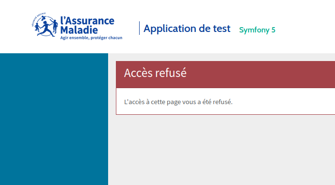

==============
Pages d'erreur
==============

Paramétrage
-----------

Des templates spécifiques sont utilisés pour afficher les erreurs en production.

Les templates sont disponibles dans le répertoire ``@Front\Resources\views\Exception``.
À chaque statut, correspond un template (ex: ``error404.html.twig``). Si le template
adéquat n'est pas présent, le template par défaut ``error.html.twig`` est affiché.

Ces templates sont activés automatiquement. Le bundle s'appuie
sur la redéfinition d'un contrôleur dédié à l'affichage des erreurs.

Ce paramétrage est visible grâce à la commande :

.. code-block:: bash

    php bin/console debug:config framework error_controller

Prévisualisation
----------------

Pour prévisualiser le rendu des erreurs en environnement *dev*, utilisez les routes prévues par *FrameworkBundle*.

.. code-block:: bash

    # config/routes/framework.yaml
    when@dev:
        _errors:
            resource: '@FrameworkBundle/Resources/config/routing/errors.xml'
            prefix:   /_error

Ex: ``http://localhost/_error/404``

Personnalisation
----------------

Pour restaurer le comportement par défaut de *Symfony* en utilisant le contrôleur du ``FrameworkBundle`` :

.. code-block:: yaml

    # config/packages/framework.yaml
    framework:
        error_controller: ~

Pour utiliser votre propre contrôleur :

.. code-block:: yaml

    framework:
        error_controller: App\\Controller\\ErrorController::action

Vous pouvez également utiliser vos propres templates en créant un répertoire
``template/bundles/FrontBundle/Exception`` dans votre projet et y ajouter les templates surchargés.

Vous pouvez par exemple créer un fichier ``template/bundles/FrontBundle/Exception/error404.html.twig``
pour modifier l'affichage en cas de page introuvable.

Vous pouvez également créer une page pour un statut qui ne bénéficie pas encore d'un
traitement particulier, ex: ``template/bundles/FrontBundle/Exception/error405.html.twig``.

.. note::
    Vous pouvez vous inspirer des fichiers ``@FrontBundle/Resources/views/Exception`` inclus dans le bundle.

.. note::
    L'exception est disponible dans le template au travers de l'objet ``app.request``.
    Ex: ``{{ app.request.attributes.get('exception') }}``.

Lisez la documentation *Symfony* `How to Customize Error Pages <https://symfony.com/doc/current/controller/error_pages.html>`_
pour plus d'informations sur la personnalisation des pages d'erreur.
