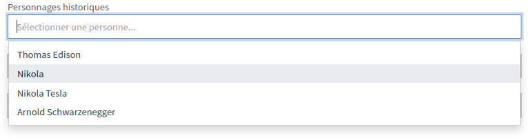

==============
Autocompletion
==============

**FrontBundle** met à votre disposition la librairie `Tom Select <https://tom-select.js.org/>`_.

Cette librairie permet d'ajouter de l'autocomplétion sur les ``<select>`` et les ``<input>``.

L'autocomplétion simplifie l'utilisation des listes et contraint la saisie.
Pour en savoir plus sur l'utilisation de cette librairie, consultez les exemples dans sa `documentation <https://tom-select.js.org/examples/>`_.

**Exemple :**

Utilisation
-----------

Pour activer l'autocomplétion sur un ``<select>``, ajoutez la classe ``tom-select``.
Le bundle activera automatiquement TomSelect.

Si vous souhaitez appliquer des settings à TomSelect, ajoutez un attribut ``tom_select_options`` contenant le tableau de paramètres **au format JSON**.

Formulaire Symfony
******************

Pour les formulaire créés avec Symfony, ajouter la classe ``tom-select`` au tableau d'attributs ``'attr' => ['class' => 'tom-select']``

**Exemple :**

.. code-block:: php

    $form = $this->createFormBuilder(null)
        ->add('tailles', ChoiceType::class, [
            'choices' => [
                'Tailles' => '',
                'small' => 'S',
                'medium' => 'M',
                'large' => 'L',
                'extra large' => 'XL',
            ],
            'attr' => [
                'class' => 'tom-select'
            ]
        ])
        ->add('user', EntityType::class, [
            'class' => Utilisateur::class,
            'placeholder' => 'Utilisateurs',
            'attr' => [
                'class' => 'tom-select',
                'tom_select_options' => json_encode([
                    'persist' => false,
                    'createOnBlur' => true,
                    'create' => true,
                    'maxItems' => 3
                ]),
            ]
        ])
        ->getForm();

HTML
****

TomSelect peut aussi être ajouté directement à du HTML natif en ajoutant la classe ``tom-select`` à la balise ``<select>``.

.. code-block:: html

    

        <label for="select">Liste déroulante <em>no settings</em></label>
        <select
            id="select"
            class="tom-select form-control"
            data-placeholder="Sélectionner une personne..."
        >
            <option value="">Sélectionner une personne...</option>
            <option value="4">Thomas Edison</option>
            <option value="1">Nikola</option>
            <option value="3">Nikola Tesla</option>
            <option value="5">Arnold Schwarzenegger</option>
        </select>
    

Settings HTML
*************

Pour ajouter des settings dans le HTML, il faut ajouter l'attribut ``tom_select_options`` à la balise ``<select>``.
Cet attribut doit contenir le tableau de paramètres **encodé en JSON**.

.. code-block:: html

    

        <label for="select-html">Liste déroulante <em>HTML settings</em></label>
        <select id="select-html" class="tom-select form-control" data-placeholder="Sélectionner une personne..."
                tom_select_options="{{ {maxItems: 2, create: true, createOnBlur: true,}|json_encode() }}">
            <option value="">Sélectionner une personne...</option>
            <option value="4">Thomas Edison</option>
            <option value="1">Nikola</option>
            <option value="3">Nikola Tesla</option>
            <option value="5">Arnold Schwarzenegger</option>
        </select>
    

Settings JS
***********

Pour modifier les settings en JavaScript, vous pouvez appeler vous-même la méthode permettant d'activer ``TomSelect``.

.. code-block:: js

    window.addEventListener("FrontBundleLoaded", (event) => {
        // Si l'attribut ``tom_select_options`` est présent, il sera pris en compte
        FrontBundle.select.apply(document.querySelector('#select_beneficiaire'));

        // Autre méthode : spécifie les options souhaitées
        FrontBundle.select.apply(document.querySelector('#select_ps'), {
            maxItems: 1
        });
    });

Contenu dynamique
*****************

*TomSelect* est activé une fois le contenu de la page chargé (événement ``DOMContentLoaded``).

L'utilisation de la méthode ``apply`` décrite dans le paragraphe précédent vous permet d'appliquer *TomSelect* à un contenu
ajouté dynamiquement (requête Ajax, réponse à un événement particulier, etc.), après que la page ait été chargée.
